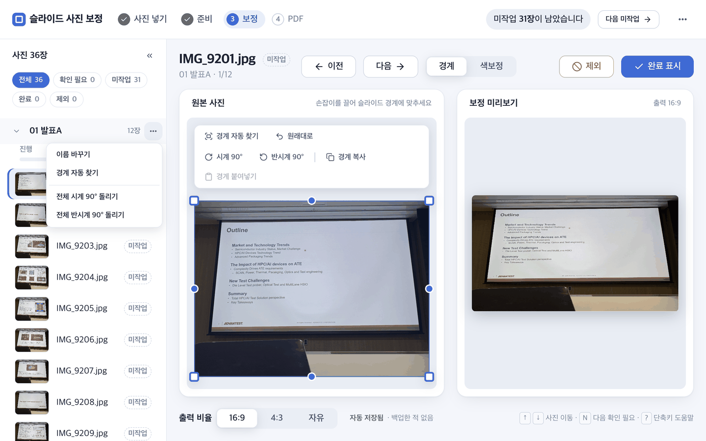

# 02. 발표로 나누기 (워크트리)

워크트리는 사진을 발표·세션별로 나눈 `02_작업장`의 폴더 구조입니다. 폴더 하나가 **발표** 하나이고, 발표 하나가 최종 PDF 하나가 됩니다. 일반 사용자는 브라우저 헤더의 `② 준비`에서 `사진 준비`만 누르면 발표 나누기부터 축소본·목록 만들기까지 이어집니다.

```text
02_작업장/
├── 01_첫발표/img/
├── 02_두번째발표/img/
├── slide_tool          (브라우저 도구)
└── worktree.json
```

## 브라우저에서 나누기

`사진 준비`를 누르면 촬영 시각이 일정 간격(기본은 “발표 간격(분)” 값) 이상 벌어진 곳에서 발표를 나눕니다. 이름은 `01_1002`처럼 시각으로 붙습니다.


준비가 도는 동안의 화면입니다. 단계와 진행 막대를 보여 주고, `작업 취소`로 멈출 수 있습니다. `자세한 기록`을 펼치면 명령과 폴더 경로가 나오니, 화면을 공유할 때는 접어 두세요.

준비가 끝나면 보정 화면으로 넘어갑니다. 발표 이름은 나중에 바꿀 수 있습니다.



왼쪽 목록의 발표 이름 옆 `⋯`(또는 발표 이름을 우클릭)을 누르면 이 메뉴가 열립니다. `이름 바꾸기`는 폴더 이름과 저장값을 함께 옮겨 주니, 탐색기에서 직접 바꾸지 마세요.

이미 나눈 뒤에 원본 사진이 늘거나 줄면 화면 위에 안내 띠가 나옵니다. 어떻게 하는지는 [03_사진_넣기](03_사진_넣기.md)를 보세요. `다시 나누기…`는 발표 이름이 새로 붙어 기존 보정 저장값이 어긋날 수 있으므로, 확인 창의 안내를 읽고 먼저 백업을 받습니다.

## 명령으로 계획 만들기

패키지 루트에서 실행합니다.

### 촬영 간격으로 자동 분할

```bash
python3 05_스크립트/init_worktree.py \
  --src 01_원본사진 --out 02_작업장 --by-gap 20
```

사진 촬영이 20분 이상 끊긴 지점에서 새 발표를 만듭니다.

### 일정표 기준

일정 파일은 `시작시각 이름` 형식입니다.

```text
09:00 첫발표
10:30 두번째발표
13:00 오후세션
```

```bash
python3 05_스크립트/init_worktree.py \
  --src 01_원본사진 --out 02_작업장 --schedule 일정.txt
```

### 기존 하위 폴더 또는 이름만 지정

```bash
python3 05_스크립트/init_worktree.py \
  --src 01_원본사진 --out 02_작업장 --by-subfolder

python3 05_스크립트/init_worktree.py \
  --out 02_작업장 --groups 첫발표 두번째발표
```

## 계획 파일과 이동

`02_작업장/worktree.json` v2는 `root`와 `source`를 계획 파일 위치 기준 상대경로로 저장합니다. 폴더 전체를 다른 위치나 한글·공백 경로로 복사해도 같은 구조를 찾아갑니다. 다른 Windows 드라이브처럼 상대화할 수 없는 경우에만 절대경로와 저장 방식이 기록됩니다.

발표 이름은 브라우저 저장 키의 일부입니다. 이름을 바꿀 때는 폴더 이름을 직접 바꾸지 말고 화면의 `이름 바꾸기`를 사용하세요. 다른 발표로 옮길 사진은 목록에서 끌어 놓거나 일괄바의 `발표 이동`을 씁니다([04_툴_사용법](04_툴_사용법.md)).

다음: [03_사진_넣기](03_사진_넣기.md)
