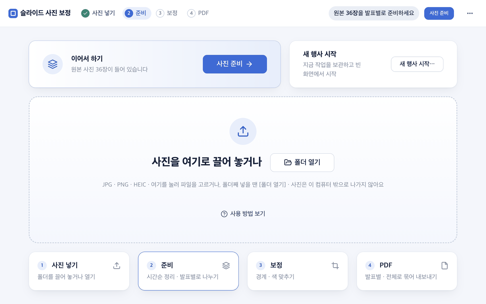
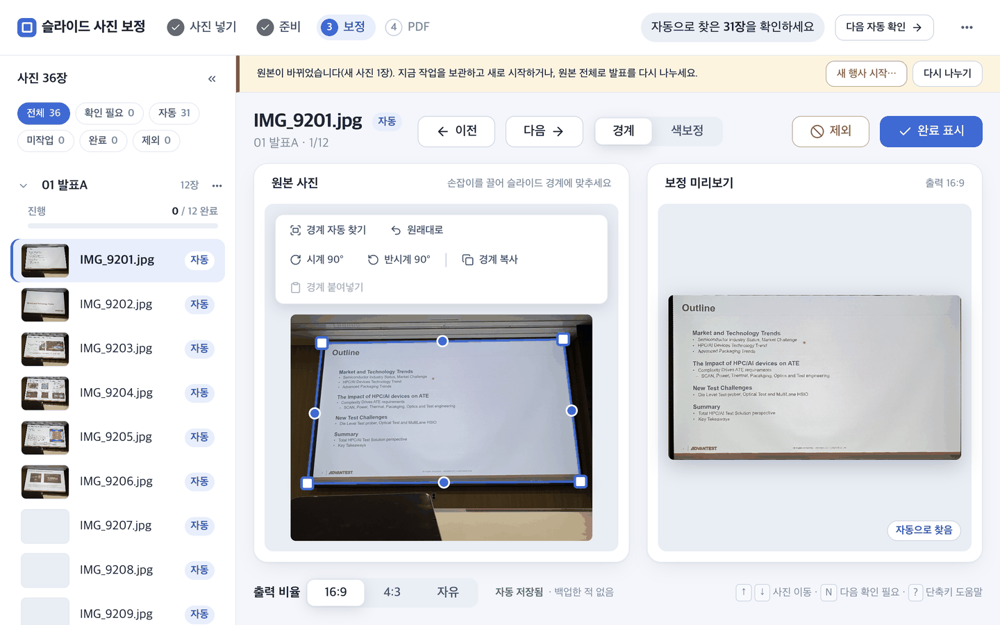
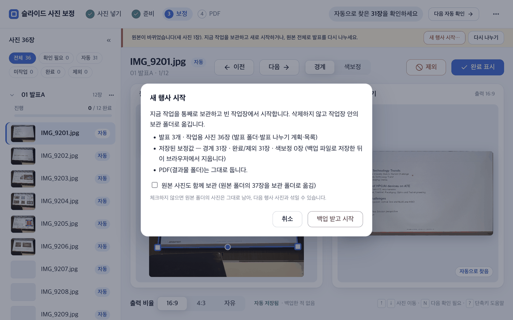

# 03. 사진 넣기

시작 화면에 사진 파일을 끌어놓고 `사진 준비`를 누릅니다. `01_원본사진`의 파일은 그대로 두고, 브라우저가 빠르게 읽을 JPEG 축소본을 `02_작업장/<발표>/img`에 만듭니다. 최종 PDF에는 축소본에서 맞춘 경계·색 값을 원본에 다시 적용합니다.

## 브라우저 화면에서

1. 사진을 점선 영역에 끌어놓습니다. 영역을 눌러 파일을 고를 수도 있습니다. 폴더째 복사하거나 사진이 많으면 `폴더 열기`를 눌러 `01_원본사진`에 직접 넣습니다.
2. 업로드 파일별 저장·거부 결과와 현재 원본 장수를 확인합니다.
3. 사진이 들어 있으면 시작 화면 맨 위에 `이어서 하기` 카드가 나옵니다. `사진 준비`를 누르고 진행이 끝날 때까지 기다립니다.
4. 왼쪽 목록의 발표별 장수가 실제 사진 수와 맞는지 확인합니다.



사진이 들어 있는 상태로 다시 열면 이 화면이 나옵니다. 왼쪽 `이어서 하기` 카드의 `사진 준비`가 다음 할 일이고, 오른쪽 카드로는 지금 작업을 보관하고 빈 화면에서 새로 시작할 수 있습니다.

촬영 시각은 사진 안의 촬영 정보(EXIF)를 먼저 쓰고, 없으면 파일 수정 시각을 씁니다. 브라우저로 올린 파일도 원래 수정 시각을 그대로 전달합니다.

## 준비 뒤에 사진이 바뀌면

준비를 마친 뒤 `01_원본사진`에 사진을 더 넣거나 빼면, 보정 화면 위에 안내 띠가 나옵니다.



"원본이 바뀌었습니다(새 사진 1장)"처럼 무엇이 달라졌는지 알려 줍니다. 지금 작업을 보관하고 새로 시작하려면 `새 행사 시작…`, 원본 전체로 발표를 다시 나누려면 `다시 나누기`를 누릅니다. 새 사진이 계획에 없는데 `그대로 준비`를 누르면 실패하니, 이 두 가지 중 하나를 고르세요.

## 새 행사 시작하기

다른 행사의 사진을 새로 작업하려면 헤더 오른쪽 `⋯` 메뉴(또는 위 카드·띠)의 `새 행사 시작…`을 누릅니다.



확인 창은 무엇이 어디로 가는지 미리 보여 줍니다. 지금 작업(발표 폴더·계획·목록)은 **삭제하지 않고** 작업장 안의 `_이전작업_…` 보관 폴더로 옮기고, 보정값은 백업 파일로 저장한 뒤 브라우저에서 지웁니다. 만든 PDF(`03_결과물`)는 그대로 둡니다. `원본 사진도 함께 보관`을 체크하면 `01_원본사진`의 사진도 보관 폴더로 옮겨, 다음 행사 사진과 섞이지 않게 합니다.

## 발표자료(PDF) 넣기

발표자료(슬라이드) PDF가 있으면 쪽마다 그림으로 바꿔 발표에 **자료**로 넣을 수 있습니다. 자료 쪽은 경계·색보정 없이 원본 그대로 PDF에 들어가고, 화면에서는 `자료` 배지가 붙어 위치가 고정됩니다.

1. 왼쪽 목록에서 자료를 넣을 발표의 `⋯` 메뉴(또는 발표 이름을 오른쪽 클릭)를 열고 `발표자료 PDF 넣기…`를 누릅니다.
2. PDF 파일을 고르면 확인 창에 "N쪽을 «발표»에 자료로 넣습니다"가 나옵니다. `넣기`를 누릅니다.
3. 진행 막대에서 "쪽 3/12"처럼 진행을 볼 수 있습니다. 끝나면 "발표자료 N쪽을 넣었습니다"가 나오고 목록이 새로 고쳐집니다. 자료 쪽은 그 발표 맨 앞에 쪽 순서대로 들어갑니다.
4. 이미 같은 번호(예: `DECK03`)의 자료가 있는 발표에 다시 넣으면 `발표자료 교체` 확인 창이 나옵니다. 교체해도 기존 쪽은 **삭제하지 않고** 그 발표 폴더 안의 `_이전발표자료_…` 폴더로 옮깁니다.

- 자료 번호는 발표 폴더 이름 앞의 숫자입니다(`03_반도체_개론` → `DECK03`). 숫자가 없으면 아직 안 쓴 가장 작은 번호를 씁니다. 다른 발표가 이미 쓰는 번호는 쓸 수 없습니다.
- PDF를 사진 업로드 영역에 끌어놓으면 올리지 않고 "발표자료는 발표 ⋯ 메뉴의 [발표자료 PDF 넣기]로 넣으세요"라고 안내합니다.
- 이 기능은 선택 의존성 `pypdfium2`가 있어야 합니다. 없으면 메뉴 항목이 회색이고 이유가 툴팁으로 나옵니다. `python3 -m pip install pypdfium2`(현재 `.venv`)로 설치하세요. 암호가 걸린 PDF는 암호를 푼 파일로, PDF 한 개는 200MB·1,000쪽까지 넣을 수 있습니다.

쪽 그림은 두 곳에 저장됩니다. 원본 보존 원칙에 따라 원본 해상도 파일은 `01_원본사진` 쪽에 둡니다.

| 위치 | 내용 |
|---|---|
| `01_원본사진/발표자료/<발표>/DECK03_p001.jpg …` | 원본 해상도 쪽 그림(긴 변 2400px, JPEG 92)과 받은 PDF 사본 `DECK03_원본.pdf`. 사진 준비가 여기서 찾습니다 |
| `02_작업장/<발표>/img/DECK03_p001.jpg …` | 도구가 읽고 PDF 만들 때 그대로 쓰는 작업용 그림(같은 파일). `그대로 준비`가 줄이지 않습니다 |
| `02_작업장/worktree.json` | 그 발표 목록 맨 앞에 쪽 이름이 들어갑니다. 원본 변경 감지와 어긋나지 않습니다 |

`다시 나누기`를 해도 `01_원본사진/발표자료/` 안의 쪽은 촬영 사진으로 나뉘지 않고, 같은 이름의 발표가 새로 생기면 그 발표 맨 앞에 다시 이어집니다. 이을 발표가 없으면 안내만 하니 그 발표에 다시 넣으세요.

### 명령으로 넣기

```bash
python3 05_스크립트/deck_to_pages.py --pdf 발표자료.pdf --group 03_반도체_개론
python3 05_스크립트/deck_to_pages.py --pdf 발표자료.pdf --group 03_반도체_개론 --replace
python3 02_작업장/slide_tool/gen_manifest.py
```

| 옵션 | 기본 | 설명 |
|---|---:|---|
| `--pdf` · `--group` | 필수 | 발표자료 PDF · 넣을 발표 폴더 이름(`worktree.json`에 있는 이름) |
| `--deck-no` | 폴더 이름 앞 숫자 | `DECK<번호>`의 번호 |
| `--width` · `--dpi` | 긴 변 2400px | 쪽 그림 크기(둘 중 하나) |
| `--replace` | 꺼짐 | 같은 번호의 기존 쪽을 보관 폴더로 옮기고 교체(없으면 이미 있을 때 거부) |
| `--root` | 이 스크립트의 상위 폴더 | 패키지 루트 |
| `--info` | 꺼짐 | 쪽 수와 기존 쪽 수만 알려 주고 아무것도 바꾸지 않음 |

발표 나누기 계획(`worktree.json`)이 먼저 있어야 합니다. 종료 코드는 성공 0, 오류 1, `pypdfium2` 없음 2입니다. 화면에 반영하려면 마지막 줄처럼 `gen_manifest.py`를 다시 실행합니다(브라우저 메뉴는 자동으로 실행).

## 명령으로 실행

```bash
python3 05_스크립트/prepare_photos.py \
  --plan 02_작업장/worktree.json

python3 02_작업장/slide_tool/gen_manifest.py
```

계획 없이 한 발표로 만들 수도 있습니다.

```bash
python3 05_스크립트/prepare_photos.py \
  --src 01_원본사진 --out 02_작업장 --group 첫발표
```

브라우저의 `사진 준비`는 이 두 단계(축소본 만들기와 목록 생성)를 자동으로 실행합니다. 명령으로 준비했다면 `gen_manifest.py`(화면 목록 만들기)를 직접 실행해야 합니다.

## 반드시 지킬 이름 계약

- 축소본과 원본은 확장자를 제외한 파일명으로 짝을 찾습니다. `IMG_0001.HEIC`와 `IMG_0001.jpg`처럼 stem을 보존하세요.
- 폴더·파일 이름에 `#`, `?`, `%`를 쓰지 마세요.
- `02_작업장/slide_tool`은 발표 폴더와 나란히 있어야 합니다. 도구가 `../<발표>/img/<파일>` 상대경로를 사용합니다.
- 발표자료 쪽 사진은 `DECK<번호>_p<쪽>.jpg`(예: `DECK02_p003.jpg`)로 이름을 붙입니다. 화면에서는 `자료`로 표시되고 경계·색보정 없이 원본 그대로 PDF에 들어갑니다. PDF에서 만들 때는 이름을 직접 붙일 필요 없이 위의 `발표자료 PDF 넣기`(또는 `deck_to_pages.py`)를 쓰세요.
- 명령으로 사진을 추가하거나 삭제했다면 `gen_manifest.py`를 다시 실행하세요.

## 주요 옵션

| 옵션 | 기본 | 설명 |
|---|---:|---|
| `--max-px` | 1920 | 작업용 축소본의 긴 변 |
| `--quality` | 85 | 작업용 JPEG 품질 |
| `--force` | 꺼짐 | 기존 축소본도 다시 생성 |
| `--workers` | 자동 | `1`이면 기준 직렬 경로 |

사진이 보이지 않으면 [06_문제해결](06_문제해결.md)을 보세요.

다음: [04_툴_사용법](04_툴_사용법.md)
