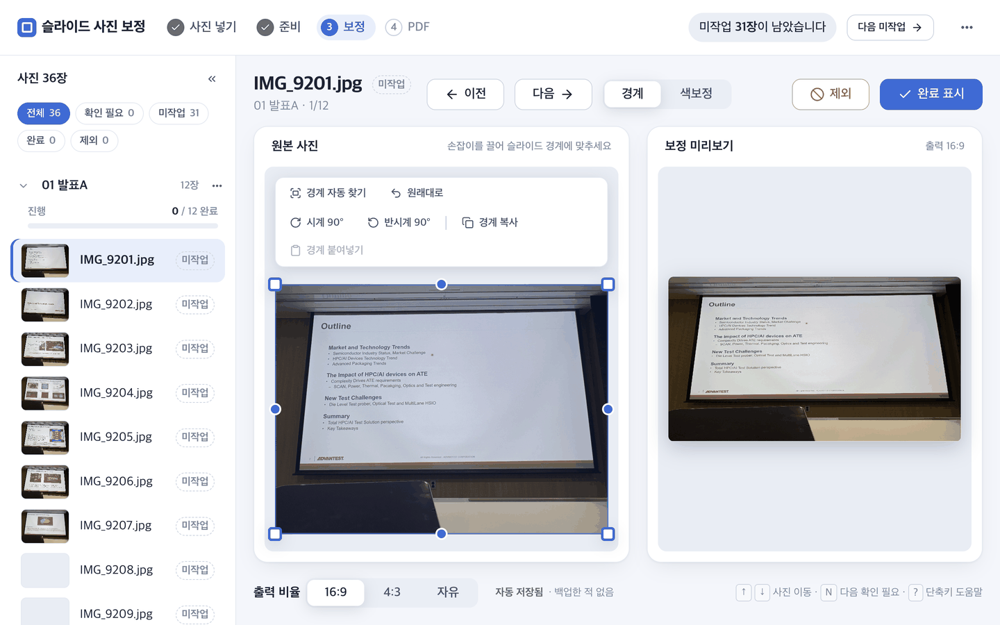
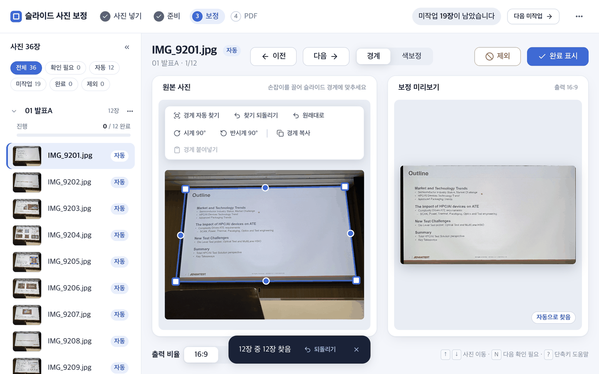
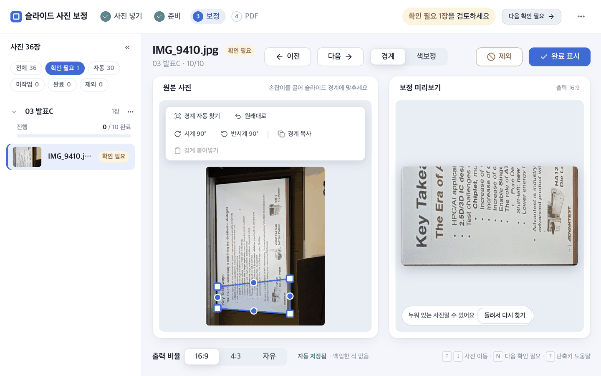
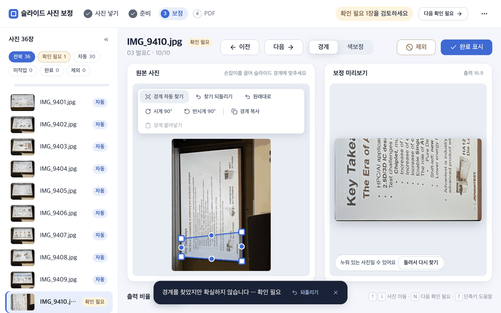
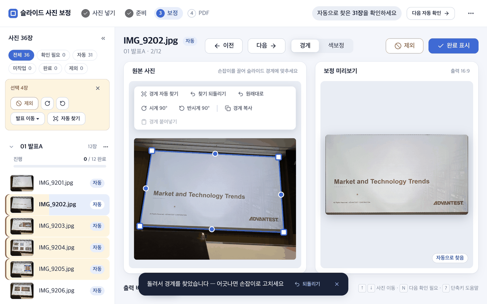
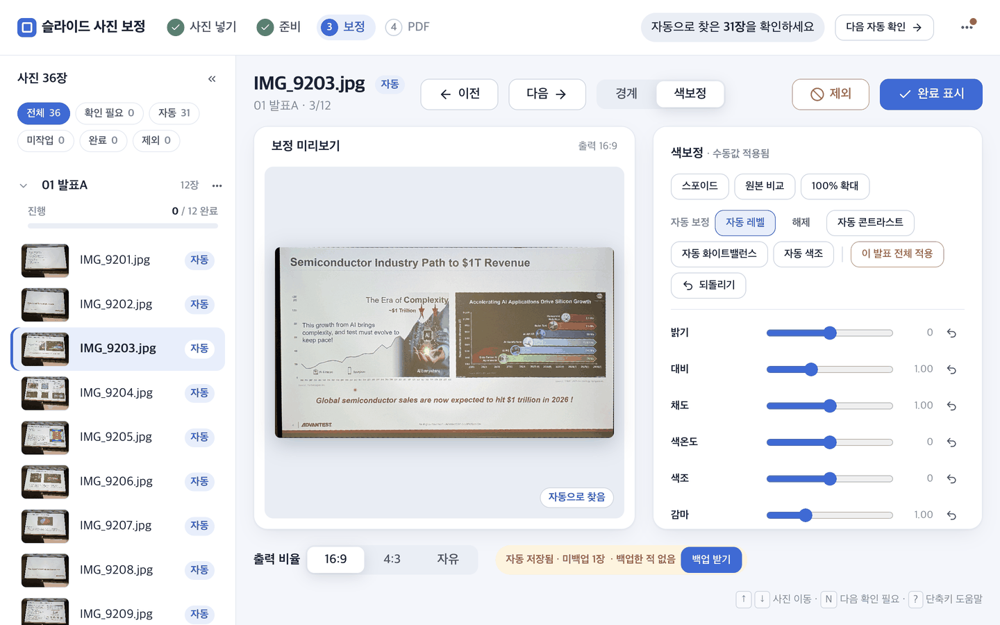
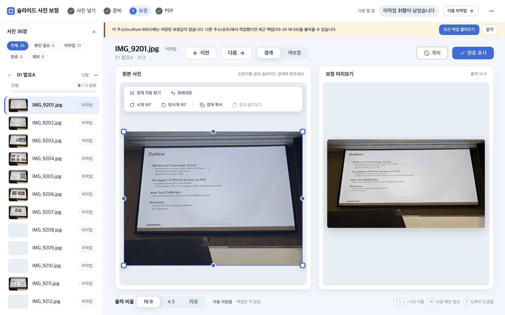
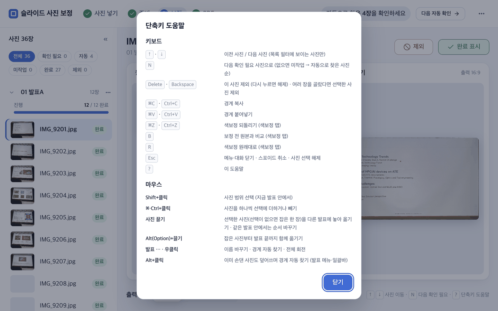

# 04. 브라우저 도구 사용법

시작 파일을 더블클릭하면 환경 준비 뒤 브라우저 도구가 **자동으로 열립니다.** 주소는 `http://127.0.0.1:<포트>/slide_tool/` 꼴이지만 직접 입력할 필요가 없습니다. 문제 해결을 위해 직접 실행할 때는 다음 명령을 패키지 루트에서 사용합니다.

```bash
python3 00_시작/serve_tool.py
```

`file://`로 직접 열면 브라우저 보안 정책 때문에 이미지 픽셀을 읽을 수 없습니다. 반드시 시작 파일이나 위 명령으로 연 주소를 쓰세요.

## 0. 화면 구성

- **헤더**: 단계 표시 `① 사진 넣기 → ② 준비 → ③ 보정 → ④ PDF`, "다음 할 일"(지금 눌러야 할 버튼), `⋯` 메뉴(백업 내보내기·불러오기, 제외한 사진 표시, 새 행사 시작, 단축키 도움말). ①·②·④는 눌러서 오른쪽 서랍으로 엽니다.
- **왼쪽 사진 목록**: 상태 필터, 발표별 목록, 여러 장 선택 때 나타나는 일괄바.
- **가운데**: 사진 한 장을 보정하는 화면. `경계` 탭과 `색보정` 탭이 있습니다.

## 1. 경계 맞추기



사진을 고르면 이 화면이 나옵니다. 원본 사진 위의 파란 사각형이 **경계**(슬라이드 영역)입니다. 네모 손잡이는 네 모서리, 동그라미 손잡이는 각 변의 가운데입니다. 손잡이를 끌어 슬라이드 경계에 맞추면 오른쪽 `보정 미리보기`에 바로 반영됩니다.

1. 왼쪽에서 사진을 고릅니다(`↑` `↓` 키로도 이동).
2. 손잡이를 끌어 촬영된 슬라이드 모서리에 맞춥니다. 직접 하기 번거로우면 아래 `경계 자동 찾기`를 씁니다.
3. `16:9`, `4:3`, `자유` 중 출력 비율을 고릅니다.
4. 카메라 위치가 같은 사진이 이어지면 `경계 복사` → 다음 사진에서 `경계 붙여넣기`(`⌘C`·`⌘V`)로 그대로 씁니다.
5. 확인이 끝나면 `완료 표시`, 흐림·중복 사진은 `제외`를 누릅니다. 다시 누르면 해제됩니다.

도구줄에는 `경계 자동 찾기`, `원래대로`(경계를 처음 상태로), `시계 90°`·`반시계 90°`, `경계 복사`·`경계 붙여넣기`가 있습니다.

### 사진 상태

사진마다 오른쪽에 상태 배지가 붙습니다.

| 배지 | 뜻 |
|---|---|
| 미작업 | 아직 손대지 않음 |
| 자동 | 경계를 자동으로 찾음. 눈으로 확인하고 `완료 표시`를 누르세요 |
| 확인 필요 | 자동으로 찾았지만 확실하지 않음. 꼭 확인하세요 |
| 완료 | 확인을 마침 |
| 제외 | PDF에서 뺌 |
| 자료 | 발표자료 쪽(`DECK…`). 손대지 않고 그대로 씀 |

### 경계 자동 찾기

슬라이드 경계를 컴퓨터가 대신 찾아 줍니다. 세 곳에서 시작합니다.

- **사진 한 장**: 도구줄의 `경계 자동 찾기`
- **발표 전체**: 발표 이름 옆 `⋯`(또는 우클릭) → `경계 자동 찾기`
- **여러 장**: 사진을 선택한 뒤 일괄바의 `자동 찾기`

이미 손댄 사진은 건너뜁니다. 덮어쓰려면 `Alt`(Option)를 누른 채 누르세요. 끝나면 화면 아래에 "12장 중 12장 찾음" 같은 알림이 뜨고, 그 자리의 `되돌리기`로 취소할 수 있습니다.



발표 하나를 자동으로 찾은 뒤의 모습입니다. 사진마다 `자동` 배지가 붙고, 찾은 경계가 원본 사진 위에 그려집니다. 결과가 마음에 들지 않으면 손잡이로 고치세요.

### 확인 필요 사진만 이어서 보기

자동 찾기가 확신하지 못한 사진은 `확인 필요`가 됩니다. 왼쪽 위의 상태 필터(전체 · 확인 필요 · 자동 · 미작업 · 완료 · 제외)를 눌러 그 상태의 사진만 모아 볼 수 있고, `N` 키(또는 헤더의 `다음 확인 필요`)를 누르면 다음 확인 필요 사진으로 넘어갑니다. 확인 필요가 없으면 미작업, 그다음 자동 순으로 넘어갑니다.



`확인 필요` 필터를 켠 모습입니다. 목록에는 해당 사진만 남고, 헤더의 "다음 할 일"도 확인 필요 사진을 검토하라고 알려 줍니다.

### 옆으로 누운 사진 세우기

카메라를 90° 눕혀 찍으면 슬라이드가 옆으로 누운 채 나옵니다. 자동 찾기도 이런 사진은 `확인 필요`로 남기고, 미리보기 아래에 `누워 있는 사진일 수 있어요` 안내와 `돌려서 다시 찾기` 버튼을 보여 줍니다.



`돌려서 다시 찾기`를 누르면 사진을 세워서 경계를 다시 찾습니다. 직접 세우려면 `시계 90°`·`반시계 90°`를 씁니다. 원본 사진 파일은 바뀌지 않고 모서리 지정 순서만 돌아가므로 최종 PDF에도 그대로 반영됩니다. 잘못 돌렸다면 반대 방향 버튼으로 정확히 원래대로 돌아옵니다(네 번 돌리면 처음 상태).

## 2. 여러 장 한꺼번에 다루기

목록에서 `Shift` 클릭으로 범위를, `Ctrl/⌘` 클릭으로 하나씩 고르면 목록 위에 **일괄바**가 나타납니다.



일괄바로 선택한 사진을 한꺼번에 `제외`하거나, 시계·반시계로 돌리거나, `발표 이동 ▾`으로 다른 발표에 옮기거나, `자동 찾기`를 실행할 수 있습니다. 오른쪽 위 `×`(또는 `Esc`)로 선택을 풉니다.

사진을 끌어서 옮길 수도 있습니다.

- **끌기**: 다른 발표에 놓으면 선택한 사진(선택이 없으면 잡은 한 장)이 옮겨집니다. 같은 발표 안에서는 순서가 바뀝니다.
- **`Alt`(Option) + 끌기**: 잡은 사진부터 발표 끝까지 함께 옮깁니다.

옮긴 뒤 알림의 `되돌리기`로 취소할 수 있습니다. 발표 이름은 `⋯` 메뉴의 `이름 바꾸기`로 바꿉니다.


발표 이름 옆 `⋯`(우클릭도 같음)의 메뉴입니다. 이름 바꾸기, 발표 전체 경계 자동 찾기, 발표 전체 회전이 있습니다.

## 3. 색보정

사진 위쪽의 `색보정` 탭으로 바꾸면 밝기, 대비, 채도, 색온도, 색조, 감마, 화이트·블랙 포인트, 선명도 등을 조절합니다.



`색보정` 탭 화면입니다. 오른쪽 위의 `자동 보정` 버튼들로 시작하고 슬라이더로 다듬습니다. `이 발표 전체 적용`은 지금 값을 같은 발표의 모든 사진에 덮어쓰므로 확인 창이 한 번 더 뜹니다.

- 색을 보존하며 명암만 펴려면 `자동 콘트라스트`
- 색 치우침까지 정리하려면 `자동 레벨` 또는 `자동 화이트밸런스`, 형광등의 녹색기는 `자동 색조`
- `스포이드`로 회색이어야 할 곳을 찍으면 색온도·색조를 맞춥니다
- `PY≈` 표시는 브라우저에서 근사 미리보기를 쓰며 최종 PDF에서 정밀 계산됨
- `되돌리기`(`Ctrl+Z`/`⌘Z`)로 이 사진의 색보정 동작을 되돌립니다
- `b`로 원본과 비교하고 `R`로 이 사진의 색을 원래대로 돌립니다

## 4. 저장과 백업

작업값은 현재 브라우저에 자동으로 저장됩니다(화면 아래 `자동 저장됨`). 다만 저장 공간은 **브라우저와 주소(포트)마다 따로**입니다. 다른 브라우저, 다른 포트, `localhost`와 `127.0.0.1`의 차이, 시크릿 창은 서로 별개입니다.

작업 중간과 끝낼 때는 헤더 `⋯` 메뉴의 `백업 내보내기`로 `slide_tool_backup_<시각>.json`을 보관하세요. 이 JSON에는 경계, 비율, 완료·제외, 색보정, 발표 이동 정보가 들어 있고 이미지는 들어 있지 않습니다. 화면 아래 저장 상태 줄이 "미백업 N장"으로 바뀌면 `백업 받기` 버튼이 나옵니다. PDF를 만들 때도 같은 백업이 `03_결과물/백업/`에 자동으로 남습니다.

주소가 바뀌어 작업이 비어 보이면 화면 위에 띠가 나옵니다.



"이 주소에는 저장된 보정값이 없습니다. …최근 백업을 불러올 수 있습니다"라는 띠입니다. `최근 백업 불러오기`를 누르면 `03_결과물/백업/`의 가장 최근 백업으로 복원합니다. 다른 파일로 복원하려면 `⋯` 메뉴의 `백업 불러오기…`를 씁니다.

PDF는 헤더의 ④ PDF 단계에서 원본 사진을 기준으로 만듭니다([05_PDF_내보내기](05_PDF_내보내기.md)). `백업 내보내기`·`백업 불러오기`는 PDF가 아니라 작업 상태 JSON을 저장·복원하는 기능입니다.

## 단축키



`?` 키를 누르면 이 도움말이 열립니다(헤더 `⋯` 메뉴의 `단축키 도움말`도 같음).

| 키 | 동작 |
|---|---|
| `↑` `↓` | 이전·다음 사진 |
| `N` | 다음 확인 필요 사진(없으면 미작업 → 자동) |
| `Delete`, `Backspace` | 제외 전환(여러 장 선택 중이면 선택한 사진) |
| `Ctrl/⌘+C`, `Ctrl/⌘+V` | 경계 복사·붙여넣기 |
| `Ctrl/⌘+Z` | 색보정 되돌리기(색보정 탭) |
| `b` | 원본 비교(색보정 탭) |
| `R` | 색보정 원래대로(색보정 탭) |
| `Esc` | 메뉴·대화 닫기, 스포이드 취소, 선택 해제 |
| `?` | 단축키 도움말 |
| `Shift`+클릭 / `Ctrl·⌘`+클릭 | 사진 범위 선택 / 하나씩 선택 |
| 끌기 / `Alt`+끌기 | 사진 옮기기 / 잡은 사진부터 발표 끝까지 옮기기 |
| `Alt`+클릭 | 이미 손댄 사진도 덮어쓰며 경계 자동 찾기 |

다음: [05_PDF_내보내기](05_PDF_내보내기.md)
