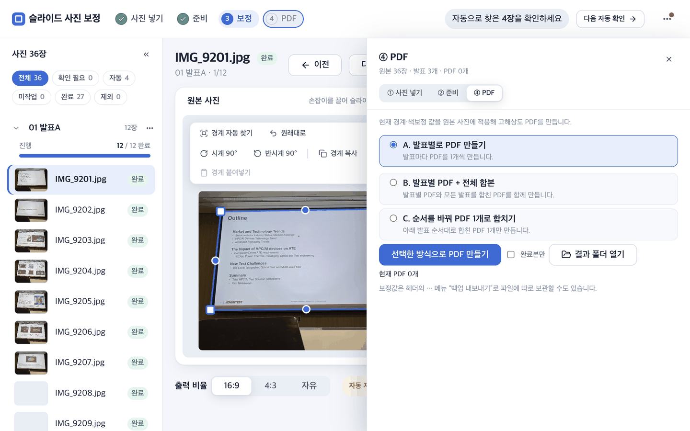
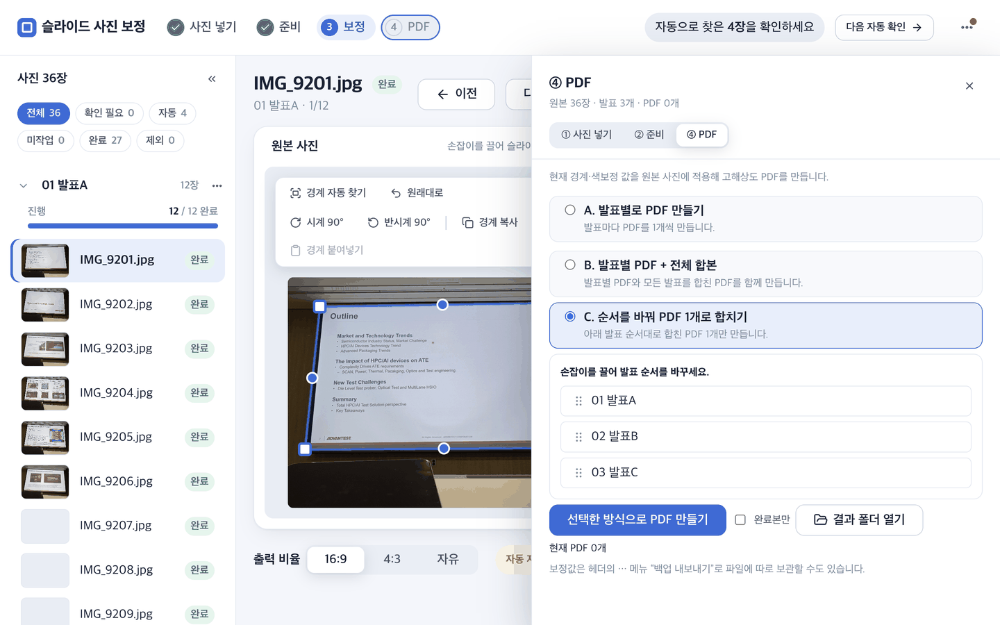
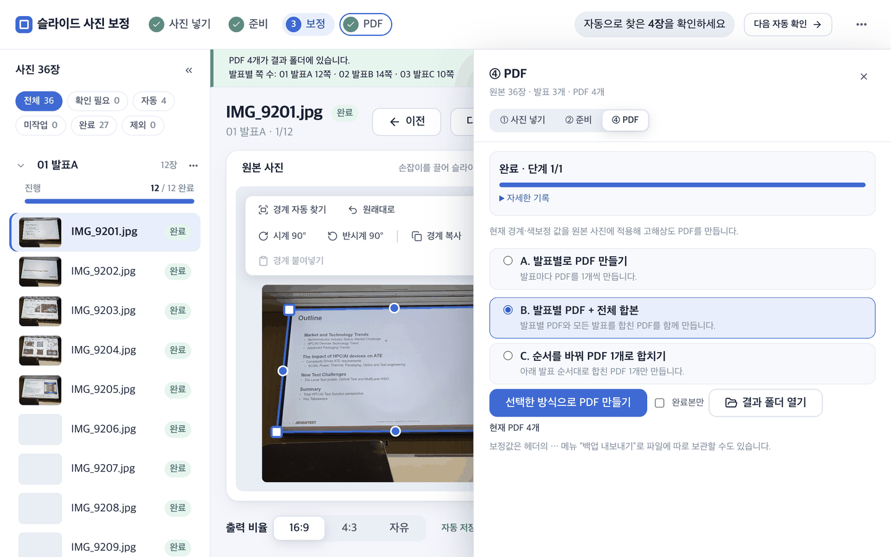

# 05. 고해상도 PDF 내보내기

브라우저의 현재 원근·색 값을 `01_원본사진`에 적용해 `03_결과물`에 고해상도 PDF를 만듭니다.

## 브라우저에서 만들기

헤더의 `④ PDF`를 누르면 오른쪽에 PDF 서랍이 열립니다.



세 가지 방식 중 하나를 고르고 `선택한 방식으로 PDF 만들기`를 누릅니다. 맨 위 줄에는 원본 장수·발표 수·지금 있는 PDF 수가 나옵니다.

1. 필요하면 `완료본만`을 체크합니다(완료 표시한 사진만 넣습니다).
2. 방식을 고릅니다.
   - **A. 발표별로 PDF 만들기**: 발표마다 PDF를 1개씩 만듭니다.
   - **B. 발표별 PDF + 전체 합본**: 발표별 PDF와 모든 발표를 합친 `전체.pdf`를 함께 만듭니다. 발표가 두 개 이상일 때만 보입니다.
   - **C. 순서를 바꿔 PDF 1개로 합치기**: 발표 순서를 정하고 그 순서의 합본 1개만 만듭니다. 발표가 두 개 이상일 때만 보입니다.
3. 단계·진행 막대가 끝날 때까지 기다립니다. 서버가 현재 보정값의 백업 사본도 `03_결과물/백업`에 보존합니다.
4. 완료 배너와 `결과 폴더 열기`로 생성된 PDF를 확인합니다.



방식 C를 고르면 발표 순서 목록이 나타납니다. 왼쪽의 점 여섯 개 손잡이를 끌어 발표 순서를 바꾸면, 그 순서대로 합본 PDF 하나가 만들어집니다.



방식 B로 만든 뒤의 화면입니다. 위쪽 띠에 "PDF 4개가 결과 폴더에 있습니다"와 발표별 쪽 수가 나옵니다. 쪽이 하나도 없어 빠진 발표가 있으면 여기에 함께 표시되니, 기대한 쪽 수와 맞는지 확인하세요. 이때 PDF 4개는 발표별 3개와 합본 1개입니다.

### 어떤 사진이 어떤 순서로 들어가나

- 경계를 한 번도 손대지 않은 사진도 들어갑니다. 사진 전체 프레임을 그대로 쓰고, `제외`한 사진만 빠집니다. 다만 경계를 맞추지 않은 사진은 슬라이드 밖 배경이 함께 나오니, PDF를 만들기 전에 왼쪽 필터의 `미작업`이 0인지 보세요.
- 발표자료 쪽(`DECK<번호>_p<쪽>.jpg`, 화면에서는 `자료`)은 보정 없이 원본 그대로 들어갑니다. `완료본만`이어도 빠지지 않습니다.
- 쪽 순서는 화면 순서(촬영순 + 끌어서 바꾼 순서 + 다른 발표로 옮긴 결과)와 같습니다.
- 같은 이름의 PDF가 있으면 새로 만든 것으로 바뀝니다. 남겨 둘 PDF는 미리 다른 곳에 복사하세요.

## 백업 파일로 명령 실행

브라우저 API를 사용할 수 없거나 예전 백업을 다시 출력할 때는 기존 `백업 내보내기`로 받은 JSON을 사용합니다.

```bash
python3 05_스크립트/export_pdf.py \
  --backup ~/Downloads/slide_tool_backup_날짜시각.json \
  --root 02_작업장 \
  --src-dir 01_원본사진 \
  --out 03_결과물
```

| 인자 | 뜻 |
|---|---|
| `--backup` | 브라우저가 내보낸 JSON |
| `--root` | 발표 폴더와 브라우저 도구가 있는 `02_작업장` |
| `--src-dir` | 원본 사진 폴더. 하위 폴더까지 검색 |
| `--out` | PDF를 저장할 `03_결과물` |

## 주요 옵션

| 옵션 | 기본 | 설명 |
|---|---:|---|
| `--width` | 1600 | 출력 가로 픽셀 |
| `--dpi` | 150 | PDF 해상도 메타값 |
| `--inset` | 0 | 각 변의 추가 크롭 비율 |
| `--only-done` | 꺼짐 | 완료 표시한 사진만 출력 |
| `--only <발표>` | 전체 | 특정 발표만 출력 |
| `--merge <파일명>` | 없음 | 발표별 PDF를 통합 |
| `--workers` | 자동 | `1`이면 기준 직렬 경로 |

기본 `--inset 0`은 슬라이드 가장자리의 각주·출처·페이지 번호를 보존하기 위한 값입니다. 필요한 경우에만 조금씩 올리고 결과를 확인하세요.

## 화질과 색

- 원본을 찾으면 원본 해상도에서 원근과 색을 계산합니다.
- `⚠️ 원본 없음`이 나오면 파일 stem과 `--src-dir`을 확인하세요. 축소본 대체 결과는 화질이 낮습니다.
- 브라우저 `COLOR_CORE`와 Python 색 코어는 파리티 테스트로 픽셀 일치를 검증합니다. 일부 무거운 정리 효과는 브라우저보다 최종 PDF가 더 정밀합니다.
- 통합 기능에는 poppler의 `pdfunite`가 필요합니다. 없으면 잡 로그에 설치가 필요하다는 오류가 표시됩니다.

문제가 있으면 [06_문제해결](06_문제해결.md)을 보세요.
